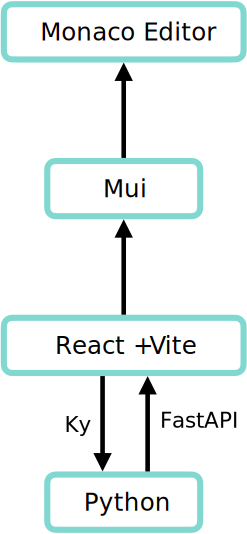

<div align="center">
  
  
  
  
  
	
  <br />
  
	
	
 </div>


## 功能特色

- Web UI 操作简便直观。
- 滚动加载机制，即使面对大文件也能轻松运行。
- 比正则更简单的匹配机制，并同时支持数字与中文数字。
- 提供多种匹配与编辑模式，自动清洗与自定义修改清晰简洁。

## 安装

### Docker 安装（推荐）

```bash
docker run -d -p 8888:80 -v /home/path/to/txt:/app/txt txt_cleanto_epub:latest
```

也可以选择从Github镜像安装：

```bash
docker run -d -p 8888:80 -v /home/path/to/txt:/app/txt ghcr.io/xu-xihe/txt_cleanto_epub:latest
```

### 本地安装

> [!CAUTION]
>
> 后端api依靠nginx转发路径/api/，如有需要请更改nginx配置。

1. 下载[最新release包](https://github.com/Xu-Xihe/TXT_cleanTo_EPUB/releases)

2. 首先确保正确安装 `nginx` 并导入项目根目录下 `nginx.conf` 配置文件：

   ```bash
   mkdir /etc/nginx/conf.d/
   mv nginx.conf /etc/nginx/conf.d/
   nginx -s reload
   
   # 检查配置是否生效
   nginx -T
   ```

3. 复制前端文件至 `nginx` 指定目录：

   ```bash
   mv dist/* /usr/share/nginx/html
   ```

4. 启动python后端服务器：

   ```bash
   python3 start.py
   ```

5. 访问 `http://127.0.0.1:80`

### 开发模式

```bash
git clone https://github.com/Xu-Xihe/TXT_cleanTo_EPUB.git
cd TXT_cleanTo_EPUB
npm i
pip install -r requirements.txt
npm run dev
python3 start.py
```

## 项目架构


